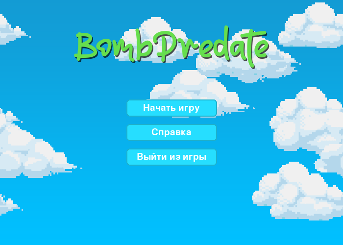

# Bomb Predate

Игра-аркада, суть которой победить противника взорвав его. Два игрока находятся на поле, заполненными коробками. У каждого игрока есть бомбы (максимум 3 бомбы). При использовании бомбы, через 3 секунды даётся новая. Бомбы можно ставить только на клетки, которые не заняты другими предметами. Стоит отметить, что у бомб особое поведение взрыва — взрыв зависит от уже взорванных коробок и пустого пространства вокруг бомбы. Взрыв происходит по кресту.

### Реализация
Игра была реализована с помощью PyGame и стандартными библиотеками Python.
Стоит отметить, что было реализованно множество классов на основе класса `pygame.sprite.Sprite`.

**Описание main.py:**
`main` — главная функция. Инициализация главных элементов игры, их прорисовка, обновление состояния спрайтов и обработка событий происходит именно здесь.
`load_image` — функция для загрузки изображений в игру.
`make_menu`, `make_start_menu`, `make_game_ended_menu` — функции, отвечающие за инициализацию интерфейса (кнопки, текст и т.д.)
`Border` — класс, реализующий барьер на краях игровой доски.
`Board` — класс, реализующий игровую доску. Распределяет предметы на доске.
`Entity` — базовый класс для спрайтов игроков. Управление реализованно также в этом классе.
`Player`, `Enemy` — классы наследованные от *Entity*. Различаются только цветом и кнопками управления.
`Box` — класс спрайта коробки. Может ломаться бомбой.
`BoxParticle` — класс частицы для эффекта разрушения коробки.
`BombExplosion` — класс анимации взрыва для бомбы.
`Bomb` — класс бомбы. Алгоритм взрыва хранится здесь.
`Button` — класс кнопки. Сделан для взаимодействия пользователя с меню.
`Cloud` — класс облака. Реализован для фона.
`Text` — класс текста. Создаёт текст как спрайт.
`GameInterface` — класс интерфейса. Отображает количество бомбочек у игроков во время игры.

**Файлы ресурсов** для игры (картинки и шрифты) хранятся в папке `data/`

### Демонстрация игры

**[Видео-демонстрация проекта](./preview/gameplay%20demo.mp4)**